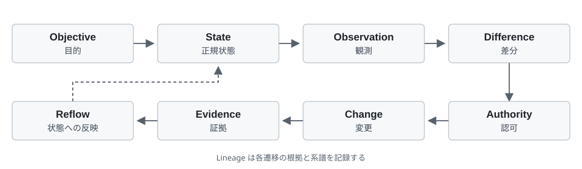

# Governance continuity in AI agent development

**Analysis of the design and public development records of MANOSUBE Agent Civilization OS**

SHUKOU | Design and experience report, public discussion draft, second Japanese edition dated October 7, 2026.

English translation draft dated October 9, 2026, prepared with Codex assistance and awaiting author review. This translation preserves the source edition's analysis date, fixed code version and evidence boundaries. It introduces no new experimental results. The [Japanese source](MANOSUBE_governance_continuity_ja.md) controls any translation ambiguity.

## Abstract

In long-running development and operation by AI agents, preserving conversation and execution history does not necessarily transfer objectives, operational authority or completion grounds correctly to the next executor. We define this problem as governance continuity and analyze MANOSUBE Agent Civilization OS through its design, public implementation, existing comparison material and development records concerning executor selection. Through an eight-stage cycle, the system connects objectives, permitted changes, evidence bound to its verification subject and unresolved differences to shared canonical state. We identify four invariants: identification of objectives and subjects, binding of authority to scope, preservation of evidence subjects and freshness, and inheritance of unresolved matters. An existing comparison with a protocol frozen in advance found that direct execution and the canonical cycle both succeeded on two simple tasks. A one-line Copilot test addition also has public records connecting implementation, review, human acceptance, merge and after-state confirmation. These support the feasibility of the comparison procedure and a bounded development cycle. They do not measure a general reliability or safety advantage. The contribution is a design and implementation case connecting existing persistence and authorization techniques to development meaning and acceptance conditions, together with falsifiable evaluation questions for their benefit.

Keywords: AI agents, software engineering, governance state, authorization, evidence, long-running execution, reproducibility.

## 1 Introduction

AI agents combine code editing, external tool operations and plans with multiple steps into an execution process. As execution grows longer, the relationships among what to do, what may be done and what counts as completion become more complex. Unless these relationships survive model updates, conversation compression, executor replacement and environmental changes, agents that appear to participate in the same project may act under different assumptions.

The central proposition is that continuity of execution must be accompanied by continuity of the grounds for authorizing change and accepting completion. External storage alone does not necessarily preserve those relationships.

Practical reports discuss losing track of progress and declaring completion prematurely in long-running work [1][1]. Research also identifies task verification and inter-agent misalignment among multi-agent failure modes [7][7]. These observations do not imply that state management solves every failure. Model capability, environmental uncertainty and incorrect problem definitions are independent causes.

We restrict the subject to governance of AI-assisted software development. The question is how to connect objectives, operational scope, unresolved work, adopted decisions and completion grounds to the same canonical state when the executor changes. Governance here means technical and operational project rules for permitting changes, accepting evidence and preserving unresolved matters, rather than legal institutions or organizational governance generally.

MANOSUBE is a public project that separates these rules from agent conversation history and retains them as structures of state and transition [16][16]. Its name uses “OS” for an agent-work governance substrate; it does not imply a general-purpose operating-system kernel or hardware manager. “Civilization” is not treated as evidence of the emergence of social institutions.

There are three contributions. First, we distinguish governance continuity from working memory and execution continuity and organize it into four conditions to preserve during executor replacement. Second, we relate a design connecting objectives, authority, evidence and unresolved differences through common state transitions to persistence, durable execution, authorization and runtime controls. Third, we analyze a frozen comparison and public executor-selection records, distinguishing record consistency, connection to execution paths and environmental enforcement, and design the next comparison.

## 2 Problem and method

### 2.1 Governance continuity

Working memory includes conversations, intermediate plans and tool results. Execution state includes processing position and retry information. Governance state, in our usage, includes objectives and evaluation conditions, current canonical state, observation provenance, unresolved differences, permissions and prohibitions, executed changes, admissible evidence and handoff to subsequent work. These may overlap, but restoring a conversation does not guarantee valid authority or fresh evidence.

Suppose executor A records “the tests passed” and executor B reads that statement and ends the work. If the verification subject has changed to another commit, preserving the sentence has not transferred completion grounds. Similarly, a past conversation permitting an operation need not authorize a new work unit, another file scope or another executor. Our problem is to address such confusion through records binding claims to their meaning and subjects.

- RQ1: What structures are needed to separate governance state from the executor?
- RQ2: Where do these structures overlap existing agent platforms and control techniques?
- RQ3: To what extent do the public implementation and existing records support the design?

### 2.2 Materials and evidence

Code and existing comparison material are fixed to main commit `c8f7cecd13e32133e183df8b2131859c524207b1` [16][16]–[19][19]. Executor-selection cases are treated separately using PR #104, PR #107 and Issue #106 [20][20], [21][21]. PR #107 acceptance, merge and after-state confirmation occurred after the fixed code commit and are not conflated with facts present in that version. Web materials and development records were checked on October 7, 2026.

We distinguish design descriptions, static code inspection, author-reported tests and executions, retained execution material and independent external revalidation. This is not a simple ranking of evidence strength; it clarifies which inferences are possible. Static inspection can establish the existence of a rule, but not enforcement on every real path. An execution report establishes results in its environment; generalization to other environments needs further evidence.

The source report conducted no new agent experiment or complete test-suite rerun. Related work was selected for relevance to long-running execution, persistence, authorization, verification, prompt injection and evaluation reliability. This was not a systematic review with an exhaustive search domain and predetermined inclusion criteria. Static inspection, checking retained material, author-side execution reports and independent model reruns are distinct evidence categories.

## 3 Related work and the 2026 technical context

### 3.1 Long-running execution and persistent agent infrastructure

Anthropic's long-running agent reports discuss harness design including initialization, progress records, incremental work and verification [1][1], [2][2]. They share the distinction between model capability and the machinery connecting a model to work. Our focus is how preserved progress connects to canonical objectives, permission, differences and accepted evidence.

LangGraph Persistence covers checkpoints, threads, state restoration and human intervention [3][3]. Temporal provides durable execution including recovery after failure and long waits [4][4]. External state, resumption and executor continuity are therefore not unique inventions of MANOSUBE. Its rules might be implemented on those platforms; comparison should consider different abstraction levels rather than assume competing products.

Anthropic Managed Agents describes separating persistent session history from a replaceable harness [15][15], directly overlapping the idea of state outside the executor. We do not claim this storage placement as novel. The subject is an integrated design connecting project objectives, authority and evidence to common transition rules.

### 3.2 Authorization and environmental enforcement

Cedar evaluates structured authorization policies [5][5]. MANOSUBE Authority similarly evaluates records against rules instead of directly converting natural-language self-reports into permission. Returning an authorization decision differs from making prohibited operations impossible for the real process.

Anthropic's containment design illustrates the need for environmental boundaries in addition to prompt instructions [14][14]. This directly concerns MANOSUBE's limits. If an agent can freely use shell or network through another route, an Authority refusal does not enforce restrictions outside the Kernel. Authorization evaluation, mediation of operations, credential isolation and filesystem restrictions must be verified separately.

OWASP Agent Control Standard (ACS) addresses middleware hooks across frameworks and declarative controls enforced at runtime [22][22]. External authorization and auditing are not unique problem settings. Our focus is a contract linking these controls to objectives, verification subjects, closure decisions and inheritance of unresolved differences. Direct ACS integration and comparative experiments are outside this report's scope.

### 3.3 Failure taxonomies, attacks and work-task evaluation

Cemri and colleagues analyze multi-agent failures in system design, inter-agent misalignment and task verification [7][7]. Wang and colleagues' 2026 preprint analyzes where long-horizon tasks break across multiple domains [11][11]. These support evaluating conversational consistency separately from task completion; they do not validate MANOSUBE.

AgentDojo evaluates prompt injection through externally obtained tool data and the utility effects of defenses [8][8]. An implication is that observations should not be accepted unconditionally as authority. Structuring data does not eliminate attacks: if malicious data can be registered as legitimate objectives or approval, the input boundary is breached.

TheAgentCompany evaluates agents in environments simulating enterprise work [9][9]. It informs future expansion from simple output generation to tasks involving multiple operations, approvals and artifacts. OWASP material for agentic applications organizes practical threats [13][13]; it is distinct from experimental evidence for a specific implementation's effectiveness.

### 3.4 Evaluation beyond success rate and control loops

METR explains that a time horizon is based on the time humans take to complete tasks, not continuous AI runtime, and discusses uncertainty in the estimates [10][10]. Khanal and colleagues propose separating single-run success from reliability across repeated runs [12][12]. They also report that memory scaffolding harmed performance on long-horizon tasks in their evaluated conditions. Added state cannot be assumed universally beneficial. MANOSUBE evaluation must measure incorrect completion acceptance, handoff, variation across repetitions and recording/verification costs, alongside successful tasks.

Autonomic management connecting monitoring, analysis, planning, execution and knowledge has prior examples [6][6]. MANOSUBE's cycle belongs to this lineage; different stage names alone are not novelty. The concrete contract connecting authorization, evidence acceptance, unresolved differences and executor replacement to project state is the subject.

Table 1 compares principal responsibilities described in official materials, not whether another technology could implement governance elements.

| Technology | Documented focus | Relation to this report |
| --- | --- | --- |
| Long-running harnesses [1][1], [2][2] | Progress transfer, incremental work, verification | Connect work continuity to permission and acceptance continuity |
| LangGraph / Temporal [3][3], [4][4] | Persistence, resumption, durable execution | Examine governance contracts above persistence |
| Cedar / containment [5][5], [14][14] | Authorization decisions and environmental enforcement | Separate decisions from enforcement of real operations |
| ACS [22][22] | Portable controls and runtime enforcement | Recognize authorization/audit overlap; examine development acceptance and state inheritance |
| Managed Agents [15][15] | Persistent sessions and replaceable harnesses | Prior external state; compare integrated objectives, evidence and residual differences |
| Failure analysis/evaluation [7][7]–[12][12] | Misalignment, verification, repeated-run reliability | Define future measures, not direct effectiveness evidence |

## 4 Design of state-centered governance

### 4.1 Canonical state and three boundaries

The design distinguishes Kernel, canonical-state backend and Adapters [16][16]. Kernel holds rules and evaluation semantics. The backend retains append-only events and their resulting current state. Adapters connect agents, GitHub and execution environments. Conversations and GitHub displays are projections of canonical state or input routes.

One state owner is a logical designation of what is canonical, not a requirement for a single physical server. Independent stores each claiming canonical status can diverge in adopted decisions. State ownership determines which records update canonical state and which merely report it.

Human Project Binding establishes objectives, boundaries and authority. Agents observe, propose, change and produce evidence within them. We use “Project Binding” for project setup records and “binding” for relationships among record subjects, identifiers and scope. Strong executor capability does not establish permission. Selecting a replaceable executor requires both role eligibility and a selection record specifying subject and scope.

### 4.2 The eight-stage cycle

Objective specifies purpose and acceptance conditions. State retains adopted decisions and current state. Observation inspects a subject. Difference identifies departures from the objective. Authority evaluates operations for addressing a difference. Change records permitted changes. Evidence connects results to verifiable material. Reflow returns evidence and unresolved differences to canonical state. Residual differences are those remaining after the cycle.

Figure 1. Lineage records relationships across transitions.

Lineage is not a ninth stage. It traces the objectives, states, observations, permissions, changes and evidence supporting subsequent state. The purpose is binding subjects to decisions, beyond merely retaining history.

For a test repair, the request is Objective, failure logs are Observation, deviation from expectation is Difference, permitted files and operations are Authority, the repair commit is Change, execution logs for a fixed subject are Evidence, and closure or preservation as unresolved is Reflow. A sentence saying tests passed cannot substitute for all these connections.

### 4.3 Extracted invariants

- I1 Objective and subject identity: identify the objective grounding a change and the subject being changed or verified.
- I2 Authority scope: bind permission to executor, work unit, operation and scope; distinguish candidate eligibility from selection for this work.
- I3 Evidence subject and freshness: bind evidence to its verification subject rather than unconditionally reuse old success for a new subject.
- I4 Unresolved-matter inheritance: distinguish completed from unresolved differences and preserve the latter across replacement.

Continuity means reconstructing these relationships after replacement and using them for subsequent changes and completion decisions, rather than preserving identical conversational text. These are analytical requirements, not formally proven theorems covering all implementation paths. Existing record/evaluation paths and their universal correctness are different claims.

## 5 Public implementation and enforcement boundaries

### 5.1 Authority evaluation

The fixed Authority engine is an evaluator with explicit inputs, including evaluation time [17][17]. It does not implicitly obtain information from filesystem, network or current clock. The path admits requests and Differences, admits and identifies Authority records, checks subject binding, applies prohibitions, evaluates authorization rules and minimum conditions, checks approvals and exclusions, verifies provenance and decides. Prohibitions precede authorization rules so a rule match cannot alone bypass refusal conditions.

This makes decisions for identical inputs easier to inspect; it does not guarantee truthful inputs. The evaluator decides permission, rather than executing changes or closing state. Mediation of real operations according to its result is a separate responsibility.

### 5.2 Executor selection

Executor selection distinguishes ELIGIBLE as a candidate from SELECTED for a work unit [17][17]. In the fixed development Binding, however, Claude Code is the default and non-default Copilot needs a selection record. The implementation does not treat every executor symmetrically. Provider-neutral Kernel semantics and selection of executors developing this repository are separate layers.

Selection checks bind repository, branch, base/head, Difference, adoption decision, operations and file scope. Internal consistency with API read-back receipts is checked, but an offline evaluator does not itself authenticate the existence or content of GitHub approval. URL syntax, receipt consistency and authenticity of authority on the external service each need separate checks.

### 5.3 Evidence and closure

Reflow closure has checks G1–G22 [17][17]. It rederives Difference from fresh subject-bound observation and evaluates closure against sufficient evidence. Implementation boundaries are explicit: a non-null `required_observation_scope`, for example, produces BLOCKED at G9. G19 checks agreement with a fixed invariant registry; it does not resolve provenance for arbitrary Git commits/trees at evaluation time. Freshness evaluation and rechecking freshness immediately before a Reflow commit are separate responsibilities.

Closure checks avoid erasing a difference solely on a completion declaration. Their number does not prove correctness. Narrow observations leave unseen failures. Matching hashes do not guarantee truthful content, authentic issuers or continued freshness.

### 5.4 Stages of maturity

The project distinguishes designed, implemented, statically inspected or tested, integrated, reachable through normal usage, demonstrated at runtime and accepted by a human [16][16], [18][18]. Acceptance and release of v1.0.0 mark a specified product boundary, not universal autonomy, operational safety or comparative superiority. Nonblocking unresolved differences such as FD-0005 can remain.

## 6 Analysis of existing evidence

### 6.1 A procedure frozen in advance

Phase21 comparison material includes a protocol fixed before results, raw events, outputs, receipts and a metric-recomputation route [19][19]. Task A computes SHA-256 of `MANOSUBE_PHASE21_ROUND6_TASK_A`; task B generates primes from 2 through 50. The reported executor was Claude Sonnet 5 in Claude Code within one session. This report is not provider attestation of model identity.

ABSENT directly processes tasks; PRESENT goes through the canonical cycle. Retained material shows both conditions succeeding on both tasks with corresponding byte-identical outputs.

| Item | Retained result | Supported interpretation |
| --- | --- | --- |
| ABSENT, direct | 2/2 successes | Feasibility on simple tasks |
| PRESENT, canonical cycle | 2/2 successes | Feasibility through the cycle |
| Outputs | Corresponding outputs byte-identical | Agreement, not performance advantage |
| Executor | Reported same executor/session | No generalization to multiple executors |
| Eight comparative axes | 0 fully measured, 2 partial, 6 unmeasured | Harness evidence on authority deviation and evidence completeness, not measurement of the eight cycle stages |

This supports producing simple artifacts through the canonical cycle and tracking outputs and metrics. Tasks are short and deterministic. Authority deviation, replacement, stale observations and false completion are not principal test subjects. Authority rules permit the task operations [19][19], so equal success cannot estimate authorization defense or long-term reliability benefits.

Recomputing metrics from retained events differs from reproducing original model execution. Author-side checks in a separate Windows environment also differ from independent external replication. The report's checks were limited to retained outputs and counts; it did not rerun the original agent or complete canonical cycle.

### 6.2 Measurement scope and unresolved differences

FD-0005 concerns eight comparative axes, not the eight-stage cycle [18][18]: false-completion reduction, long-term state retention, reach into execution environments, human re-explanation, rework, safe executor replacement, authority deviation and evidence completeness. None is fully measured; authority-deviation reduction and evidence completeness are partial, and six remain unmeasured. Partial measurements describe harness behavior rather than estimating effects over a sufficient task distribution. Codex-only and existing-framework conditions have not been established because of real invocation and credential constraints.

Internal Phase21 acceptance marks a development gate. External validity asks whether results generalize to other tasks, executors and environments. FD-0005 preserves the distinction and retains unestablished comparisons and unmeasured axes as unresolved.

### 6.3 An executor-selection development case

PR #104 records review and correction of a route treating Copilot as replaceable [20][20]. Findings included selection not being called from the actual evaluation path, scope comparisons using only caller-provided values, and permitted file scope not being applied to operations. Corrections connected the evaluation path, bound receipts to scope, and checked operations and paths.

Records also describe matching the same dangerous path on both sides and partial regular-expression matching of paths containing newlines; syntax validation and fullmatch followed. These are pre-fix defects, not claims that the same defects remain in the fixed version. A fixture using another real subject's authority URL was corrected to distinguish synthetic examples from verified facts.

The case separates component existence from real-path integration, value agreement from legitimate authority, and string matching from safe operational scope. Structural review is a different project role from implementation, but is not independent external reproduction. PR #104 also records additional automated-review findings [20][20]. Completed structural review does not establish that every unverified candidate finding has been resolved.

### 6.4 Acceptance and after-state of the Copilot trial

PR #107 separates Copilot CLI implementation, SHUKOU's commit/push and ChatGPT's PR preparation/structural review [20][20], [21][21]. The change adds one negative-test line rejecting a path with an internal carriage return (CR, U+000D). Copilot reported six passing cases; SHUKOU reported 113 passing cases in the target file. These are reported executions, not independently rerun results.

GitHub records show human acceptance of head `57e6e0a3a955437abc0b3a6004180aa866ac94b5` and merge on October 4, 2026 at 10:22:28 JST (01:22:28 UTC). The merge commit is `6e32bc7b3fddada77f8bcc75656e0453768a9a42`. Issue #106 records before/change/after confirmation and closure [21][21]. This connects implementation, review, acceptance, merge and after-state for one bounded work unit. Operational Reflow recorded in issue comments is not an independent demonstration of a Kernel Store transaction. The reason an initial rpds DLL problem stopped recurring remains unexplained, and the CLI session UUID was not retained. The case does not establish complete installation success or general autonomous-handoff performance and safety.

## 7 Discussion

### 7.1 Relation to agent-industry problems

Related material addresses persistent execution, environmental constraints, verifiable outcomes and repeated-run reliability alongside capability [10][10]–[15][15], [22][22]. MANOSUBE focuses on binding work meaning and acceptance conditions to project state. After replacement, success on an old commit should not become completion grounds for a new commit, and permission for old work should not expand to another scope.

The requirement spans unresolved-work inheritance, distinctions among advice/implementation/approval, separation of external input from authority and subject-bound completion. The system integrates them in a common cycle. Utility needs equal-task, equal-cost comparison against systems already providing persistence, authorization and runtime control.

### 7.2 Present research contribution

The current contribution is a design and experience report structuring governance meaning and tracing implementation paths to evidence. Other technologies may implement similar constructions. External state, authorization and control loops themselves are not claimed as novelty. The particular configuration connects objectives/subjects, permission, evidence freshness, closure and unresolved differences through one transition contract.

Public code and records enable criticism and verification. Tracing which boundary contained a defect and what connected a repair to checking paths can yield reusable design knowledge. Internal improvement history alone cannot estimate a causal reduction in defects. Comparators and falsification conditions are needed to advance from a case study to effectiveness evidence.

### 7.3 Hypotheses for the next evaluation

- H1 Completion: the canonical cycle reduces false acceptance while preserving acceptance of correct completion.
- H2 Inheritance: objectives, permission and unresolved differences survive executor replacement.
- H3 Authority: binding selection and scope reduces acceptance of out-of-scope operations.
- H4 Cost: these effects remain useful accounting for latency, cost and human checking.

These are falsifiable questions, not experimental findings of this report. Compare the same tasks under direct execution, persistence only, authorization only and full canonical cycle to separate effects. Remove closure, selection binding and Reflow individually as ablations. Fix model version, tools, credentials, scope, spending ceiling, seeds or repetition identifiers and stopping conditions in advance. Describe environmental enforcement in each condition and separately measure refusal by the Kernel evaluator and prevention of real unauthorized operations.

Tasks should include old tests, wrong heads, out-of-scope paths, adversarial tool output, replacement mid-change and unobservable external conditions. Define true completion independently, then compare acceptance. Report correct acceptance, false acceptance, false rejection, incompletion, authority deviation, inheritance loss, duration, cost and human intervention. Account for dependencies between repetitions/tasks and report uncertainty. Choose sample size from pilot evaluation and effect-size estimates; do not present two existing tasks as large-scale evidence.

| Hypothesis | Principal measurement | Falsification or harm criterion |
| --- | --- | --- |
| H1 | Acceptance among independently incomplete attempts; correct acceptance among complete attempts | No false-accept reduction or loss of correct acceptance beyond a predefined margin |
| H2 | Missing or incorrectly changed objectives, permission and unresolved items fixed before handoff | No inheritance-error reduction against comparison |
| H3 | Out-of-scope request acceptance and actual unauthorized operations | An operation succeeds elsewhere despite evaluator refusal |
| H4 | Latency, API/compute costs, human intervention time and count | Exceeds a predefined acceptable cost relative to benefit |

Independent completion assessment must not inspect system acceptance. Fix success criteria, noninferiority margins, cost ceilings and acceptable false-rejection ranges before seeing results.

## 8 Limitations and threats to validity

Construct validity includes a gap between designed sufficient evidence and real task success. An incorrect Objective can lead to failure consistently connected to canonical state. Incomplete observations can leave real residual differences despite passing closure checks. Governance consistency differs from appropriate objectives or social value.

Internal-validity threats include unequal procedures/human help across conditions, the author designing both tasks and implementation, and learning effects in review history. The existing comparison does not isolate causal effects. Large cumulative test counts are not independent empirical cases when subjects overlap or assumptions are shared.

External validity is limited to two short tasks reported as one executor and a bounded Copilot work unit with human operation and acceptance. Long-term operation, multiple organizations, hostile input and replacement by other models have not been sufficiently measured. Product publication and individual acceptance do not fill those gaps.

Enforcement boundaries matter. Policy evaluation cannot prevent deviation in an environment allowing free operations outside the Kernel. Lexically safe paths do not guarantee safe symlink or actual filesystem resolution. Append-only structure and content hashes do not prevent every administrator modification, issuer impersonation or false observation.

Operational concerns include recording/verification costs, approval waits, growing state, update contention and failure availability. Evaluate strict conditions rejecting correct changes and human checking becoming perfunctory under burden. Objective changes, exceptions and emergency work need separate verification of state preservation.

Related work is purposefully selected; some sources are preprints, corporate reports or research notes. GitHub main and comments can change. Read code at fixed commits and cases against target heads, merge commits and record URLs. Report subsequent changes as new versions.

## 9 Conclusion

Governance continuity means connecting objectives/subjects, authority scope, evidence subject/freshness and unresolved matters to the next decision despite executor changes. This report organizes that problem into four invariants and maps them to MANOSUBE design, implementation and public records.

Existing material supports feasibility of structured authorization, closure checks, selection, comparison procedures and one bounded Copilot development cycle. Both conditions succeed on the two comparison tasks; measurements of eight axes remain incomplete. The next question is what benefits and costs common governance transitions provide relative to existing technology in repeated comparisons involving replacement and false completion.

## Data and code availability

Code and comparisons are available at the fixed commit; acceptance and after-state are available through PR/issue records [16][16]–[21][21]. Appendix B lists fixed points. Checking retained outputs, recomputing metrics, rerunning the Kernel cycle and model-based replication are separate reproduction activities. Static material cannot guarantee execution of routes requiring credentials or external services.

## AI assistance disclosure

ChatGPT/Codex assisted research, structure, writing and editing of the source report and this translation. No new agent experiment results were generated for the manuscript. Static code inspection and retained-material checking are distinguished from independent model reruns. The author's final checking of claims and references continues during discussion and submission preparation.

## References

The reference list and linked fixed points below preserve the Japanese edition's source identifiers. Web/development materials were checked on October 7, 2026. This translation does not change that observation date.

<!-- References and appendix fixed-point links are copied from the source edition below. -->

1. Anthropic. [Effective harnesses for long-running agents](https://www.anthropic.com/engineering/effective-harnesses-for-long-running-agents). 2025-11-26.

2. Anthropic. [Harness design for long-running application development](https://www.anthropic.com/engineering/harness-design-long-running-apps). 2026-03-24.

3. LangChain. [LangGraph documentation Persistence](https://docs.langchain.com/oss/python/langgraph/persistence). Living official documentation.

4. Temporal. [Durable AI](https://docs.temporal.io/ai). Living official documentation.

5. Cedar. [Authorization](https://docs.cedarpolicy.com/auth/authorization.html). Living official documentation.

6. Mengusoglu, E., and Pickering, B. [Automated management and service provisioning model for distributed devices](https://research.ibm.com/publications/automated-management-and-service-provisioning-model-for-distributed-devices). ASE 2007.

7. Cemri, M., et al. [Why Do Multi-Agent LLM Systems Fail?](https://arxiv.org/abs/2503.13657v3). arXiv:2503.13657v3, 2025.

8. Debenedetti, E., et al. [AgentDojo: A Dynamic Environment to Evaluate Prompt Injection Attacks and Defenses for LLM Agents](https://arxiv.org/abs/2406.13352v3). arXiv:2406.13352v3, 2024.

9. Xu, F. F., et al. [TheAgentCompany: Benchmarking LLM Agents on Consequential Real World Tasks](https://arxiv.org/abs/2412.14161v3). arXiv:2412.14161v3, 2025.

10. Kwa, T. / METR. [Clarifying limitations of time horizon](https://metr.org/notes/2026-01-22-time-horizon-limitations/). 2026-01-22 Research note.

11. Wang, X. J., et al. [The Long-Horizon Task Mirage? Diagnosing Where and Why Agentic Systems Break](https://arxiv.org/abs/2604.11978v1). arXiv:2604.11978v1, 2026 Preprint.

12. Khanal, A., Tao, Y., and Zhou, J. [Beyond pass@1: A Reliability Science Framework for Long-Horizon LLM Agents](https://arxiv.org/abs/2603.29231v1). arXiv:2603.29231v1, 2026 Preprint.

13. OWASP. [OWASP Top 10 for Agentic Applications for 2026](https://genai.owasp.org/resource/owasp-top-10-for-agentic-applications-for-2026/). 2025-12-09.

14. Anthropic. [How we contain Claude across products](https://www.anthropic.com/engineering/how-we-contain-claude). 2026-05-25.

15. Anthropic. [Scaling Managed Agents: Decoupling the brain from the hands](https://www.anthropic.com/engineering/managed-agents). 2026-04-08.

16. SHUKOU / manosube. [MANOSUBE Agent Civilization OS README](https://github.com/manosube/manosube-agent-civilization-os/blob/c8f7cecd13e32133e183df8b2131859c524207b1/README.md). Fixed commit c8f7cecd13e32133e183df8b2131859c524207b1.

17. SHUKOU / manosube. [Authority engine, executor selection and closure](https://github.com/manosube/manosube-agent-civilization-os/blob/c8f7cecd13e32133e183df8b2131859c524207b1/src/manosube_agent_civilization/authority/engine.py). Same fixed commit. [Executor selection](https://github.com/manosube/manosube-agent-civilization-os/blob/c8f7cecd13e32133e183df8b2131859c524207b1/src/manosube_agent_civilization/development_binding/executor_selection.py), [Reflow closure](https://github.com/manosube/manosube-agent-civilization-os/blob/c8f7cecd13e32133e183df8b2131859c524207b1/src/manosube_agent_civilization/reflow/closure.py).

18. SHUKOU / manosube. [Deferred Differences Register FD-0005](https://github.com/manosube/manosube-agent-civilization-os/blob/c8f7cecd13e32133e183df8b2131859c524207b1/docs/project_sources/06_DEFERRED_DIFFERENCES.md). Same fixed commit.

19. SHUKOU / manosube. [Phase21 frozen-protocol result bundle and raw events](https://github.com/manosube/manosube-agent-civilization-os/blob/c8f7cecd13e32133e183df8b2131859c524207b1/examples/comparative_benchmark/frozen_protocol_r6/result_bundle.json). Same fixed commit. [Raw events](https://github.com/manosube/manosube-agent-civilization-os/blob/c8f7cecd13e32133e183df8b2131859c524207b1/examples/comparative_benchmark/real_agent_corpus/frozen_protocol/RAW_EVENTS.md), [Frozen protocol](https://github.com/manosube/manosube-agent-civilization-os/blob/c8f7cecd13e32133e183df8b2131859c524207b1/examples/comparative_benchmark/frozen_protocol_r6/protocol_freeze.json).

20. SHUKOU / manosube. [PR #104 and PR #107 executor selection and bounded Copilot trial](https://github.com/manosube/manosube-agent-civilization-os/pull/104). Public development record. [PR #107](https://github.com/manosube/manosube-agent-civilization-os/pull/107).

21. SHUKOU / manosube. [Accepted trial after-state reflow and closure receipt](https://github.com/manosube/manosube-agent-civilization-os/issues/106#issuecomment-5975381820). Issue #106 Development record.

22. OWASP. [Agent Control Standard ACS](https://genai.owasp.org/resource/agent-control-standard-acs/). 2026-09-01.

## Appendix A Claims and evidence

| Claim | Existing evidence | Boundary |
| --- | --- | --- |
| Implements a canonical cycle | Design, code, retained runs | No formal proof of every path |
| Structured authorization | Static Authority-engine inspection | Does not enforce operations outside Kernel |
| Scope-bound selection | Selection checks and PR #104 corrections | External authority authenticity and environmental enforcement require separate checking |
| Executable comparison procedure | Phase21, two conditions and two tasks | No established performance, safety or long-term reliability advantage |
| Accepted bounded Copilot cycle | PR #107, acceptance and Issue #106 after-state | One work unit; distinct from Kernel Store Reflow or general handoff benefit |
| Benefit from governance inheritance | Design hypothesis | Needs replacement, false-completion and cost comparison |

## Appendix B Fixed verification points

Code analysis: `c8f7cecd13e32133e183df8b2131859c524207b1`.
Accepted Copilot head: `57e6e0a3a955437abc0b3a6004180aa866ac94b5`.
After-state merge: `6e32bc7b3fddada77f8bcc75656e0453768a9a42`.
The version adding this paper differs from its analyzed version.

| Subject | Fixed reference |
| --- | --- |
| Kernel overview | [README][16] |
| Actual selection evaluation | [development_binding/evaluation.py](https://github.com/manosube/manosube-agent-civilization-os/blob/c8f7cecd13e32133e183df8b2131859c524207b1/src/manosube_agent_civilization/development_binding/evaluation.py) |
| Closure and Store integration | [reflow/route.py](https://github.com/manosube/manosube-agent-civilization-os/blob/c8f7cecd13e32133e183df8b2131859c524207b1/src/manosube_agent_civilization/reflow/route.py) |
| Phase21 retained outputs | [Frozen corpus](https://github.com/manosube/manosube-agent-civilization-os/tree/c8f7cecd13e32133e183df8b2131859c524207b1/examples/comparative_benchmark/real_agent_corpus/frozen_protocol) |
| Eight-axis measurement gaps | [FD-0005][18] |
| Copilot acceptance | [Human acceptance](https://github.com/manosube/manosube-agent-civilization-os/pull/107#issuecomment-5975350705) |
| Copilot after-state | [Merge commit](https://github.com/manosube/manosube-agent-civilization-os/commit/6e32bc7b3fddada77f8bcc75656e0453768a9a42), [receipt][21] |

[1]: https://www.anthropic.com/engineering/effective-harnesses-for-long-running-agents
[2]: https://www.anthropic.com/engineering/harness-design-long-running-apps
[3]: https://docs.langchain.com/oss/python/langgraph/persistence
[4]: https://docs.temporal.io/ai
[5]: https://docs.cedarpolicy.com/auth/authorization.html
[6]: https://research.ibm.com/publications/automated-management-and-service-provisioning-model-for-distributed-devices
[7]: https://arxiv.org/abs/2503.13657v3
[8]: https://arxiv.org/abs/2406.13352v3
[9]: https://arxiv.org/abs/2412.14161v3
[10]: https://metr.org/notes/2026-01-22-time-horizon-limitations/
[11]: https://arxiv.org/abs/2604.11978v1
[12]: https://arxiv.org/abs/2603.29231v1
[13]: https://genai.owasp.org/resource/owasp-top-10-for-agentic-applications-for-2026/
[14]: https://www.anthropic.com/engineering/how-we-contain-claude
[15]: https://www.anthropic.com/engineering/managed-agents
[16]: https://github.com/manosube/manosube-agent-civilization-os/blob/c8f7cecd13e32133e183df8b2131859c524207b1/README.md
[17]: https://github.com/manosube/manosube-agent-civilization-os/blob/c8f7cecd13e32133e183df8b2131859c524207b1/src/manosube_agent_civilization/authority/engine.py
[18]: https://github.com/manosube/manosube-agent-civilization-os/blob/c8f7cecd13e32133e183df8b2131859c524207b1/docs/project_sources/06_DEFERRED_DIFFERENCES.md
[19]: https://github.com/manosube/manosube-agent-civilization-os/blob/c8f7cecd13e32133e183df8b2131859c524207b1/examples/comparative_benchmark/frozen_protocol_r6/result_bundle.json
[20]: https://github.com/manosube/manosube-agent-civilization-os/pull/104
[21]: https://github.com/manosube/manosube-agent-civilization-os/issues/106#issuecomment-5975381820
[22]: https://genai.owasp.org/resource/agent-control-standard-acs/
